<div align="center">

# 🏃 Jogging

**Run through a photoreal world – on your own treadmill at home.**

The landscape moves as fast as your belt. The route's hills set the incline. Workouts, a ghost of your
best run and a field of fellow runners keep you going – and the whole family gets their own profile.


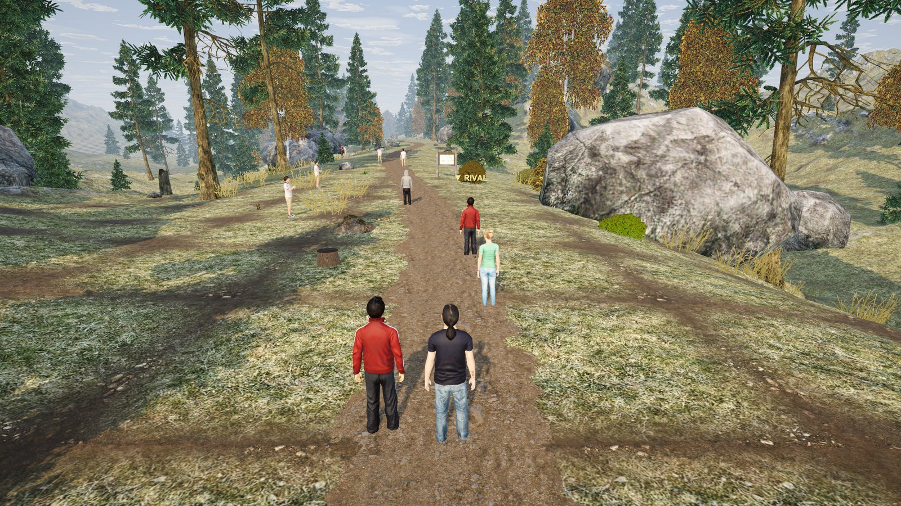

</div>

---

## Why

Treadmill running is boring. Commercial apps put you on filmed video routes or cartoon worlds and want a
subscription. Jogging generates a **new, photoreal landscape** for every run – forest paths, meadows,
lakes, mountain passes, villages – from a small recipe you can share as a QR code. It talks to the
treadmill over Bluetooth, sets the incline to the terrain, and never takes control away from you.

It started as a family project: one treadmill, several runners, a shared weekly goal.

## Highlights

| | |
|---|---|
| 🌍 **Endless, generated worlds** | Infinite MapMagic 2 terrain, a trail shaped to the route's elevation profile, forests, meadows, lakes, streams with little bridges, four seasons. |
| 🌦️ **Real sky** | Sun and moon at their true position (50° N) with today's moon phase, four cloud layers drifting at their own speed, cloud shadows sweeping across the land, stars and the Milky Way far from towns, ground fog at dawn, rain and snow. |
| 🪵 **A believable trail** | Asphalt through the village, gravel, earth, needle-covered forest paths, meadow tracks – matching the surroundings. Side paths, signposts, benches, hunting stands, log piles, wayside crosses, chapels, crows that fly up as you come. Sparse, like a real forest. |
| 🏃 **You're not alone** | Fellow runners that match your pace, a rival just ahead to chase, overtakes, spectators, and a see-through ghost of your best run. |
| ⛰️ **The treadmill follows the hills** | FitShow (e.g. Sportstech F37) and standard FTMS treadmills: incline from the route, speed from workouts (opt-in). Every command passes one safety layer. |
| ❤️ **Heart rate** | Any Bluetooth heart-rate strap, or the treadmill's hand sensors; zones on screen and in the logbook. |
| 📋 **Train with a plan** | Workouts (intervals, pyramids, hills, zone 2 …), your own workout editor, multi-week training plans, spoken announcements. |
| 👨‍👩‍👧 **Family profiles** | Several runners, each with a figure, logbook (1 Hz samples), statistics, 24 achievements, weekly goals and a family challenge. TCX export. |
| 🛠️ **Make your own routes** | Route editor (length, climbs, curviness, vegetation, water, season, weather, time of day, night sky) and a workshop to add clearings, lakes, spectators, benches or a chapel exactly where you want them. |
| 🎧 **Sounds of the way** | Synthesized live: footsteps that crunch on gravel and squeak in snow, dawn chorus, crickets, a tawny owl at night, rain, a burbling stream. |
| 🌐 **English & Deutsch, km/h & mph** | Picks the system language and region, switchable in the settings. |

## Gallery

<table>
<tr>
<td width="50%">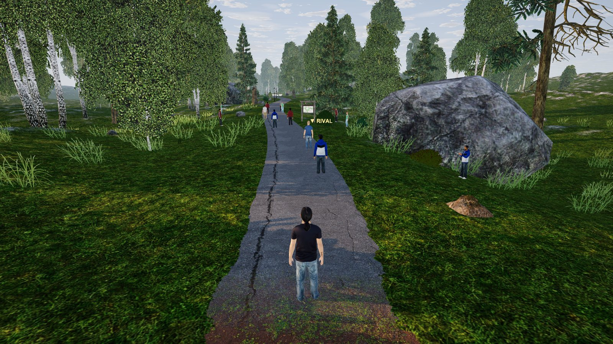<br><sub>Summer – the lake loop starts on an old farm road</sub></td>
<td width="50%">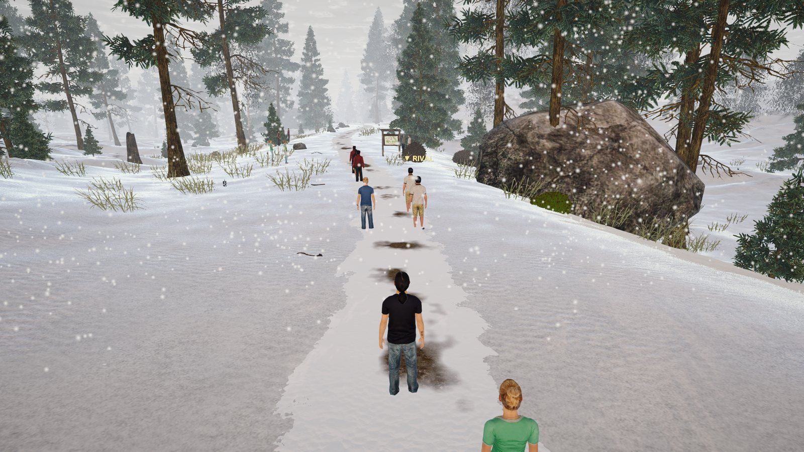<br><sub>Winter forest, snow falling</sub></td>
</tr>
<tr>
<td>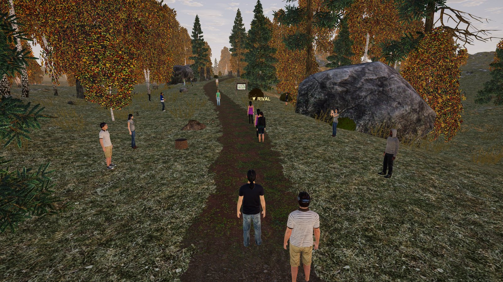<br><sub>Autumn morning on an earth path</sub></td>
<td>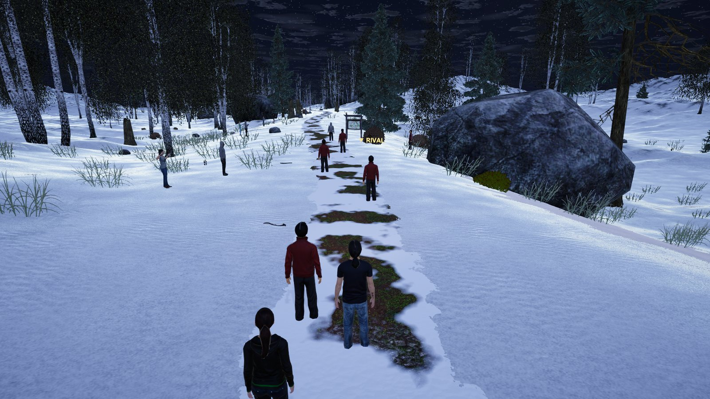<br><sub>“Moonlit night” – a clear winter night run</sub></td>
</tr>
<tr>
<td>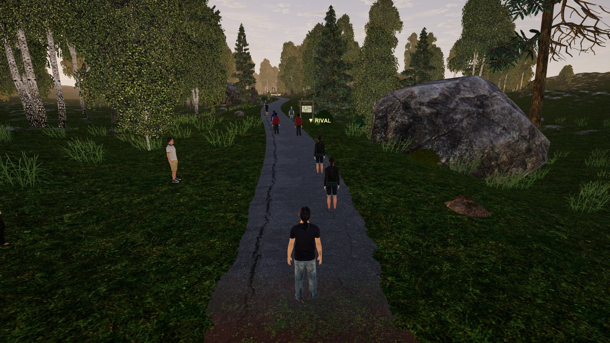<br><sub>Dusk – a quick run gets a random time of day</sub></td>
<td>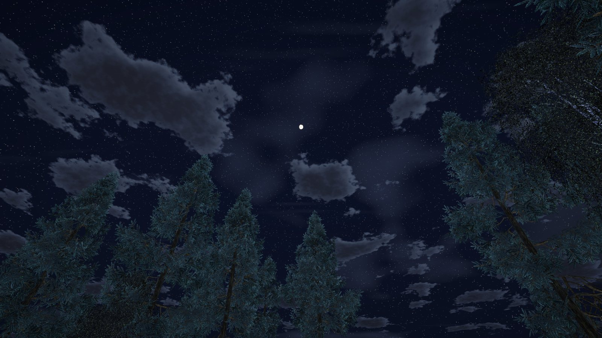<br><sub>The night sky: moon, stars, moonlit clouds</sub></td>
</tr>
<tr>
<td>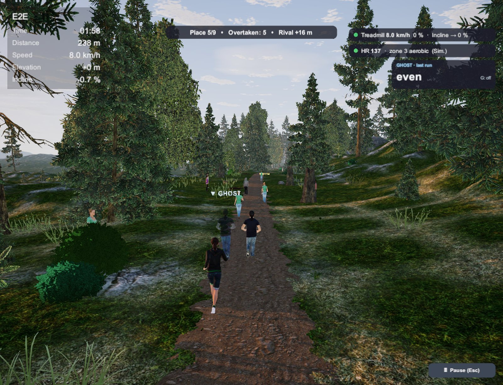<br><sub>Running: HUD, rival, heart-rate zone, the ghost of your last run</sub></td>
<td>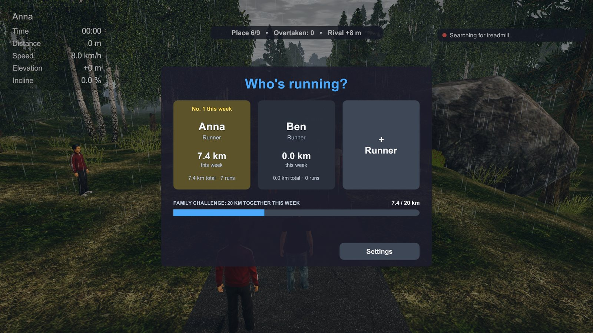<br><sub>“Who's running?” – runners and the family challenge</sub></td>
</tr>
<tr>
<td>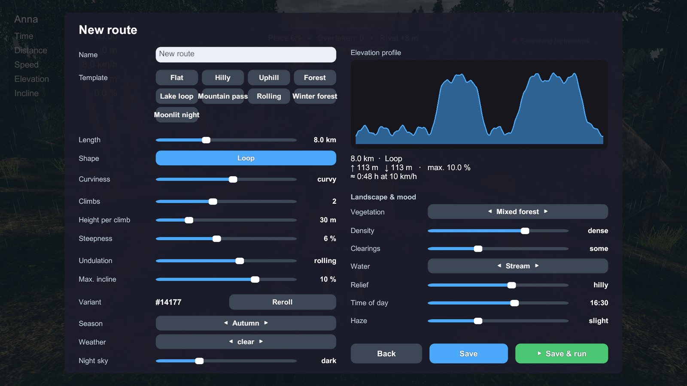<br><sub>Route editor with the elevation profile</sub></td>
<td>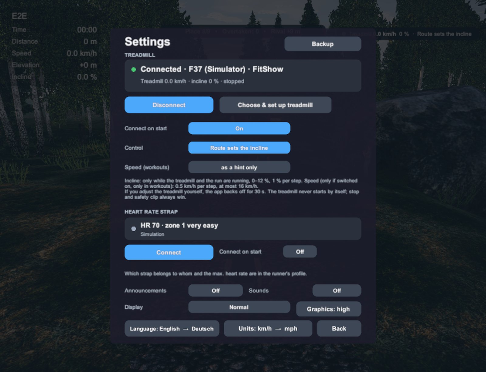<br><sub>Settings: treadmill, heart-rate strap, language, units</sub></td>
</tr>
</table>

## How it works

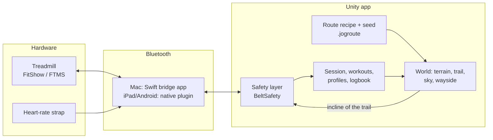

- **A route is a recipe**, not a video: parameters plus a seed (`.jogroute`, a few hundred bytes – small
  enough for a QR code). The generator shapes the elevation profile, the terrain is carved to it, and
  everything along the way is planned deterministically from the seed.
- **One scene, everything streamed** around the runner: terrain tiles, trees, the trail band, the
  wayside objects. Tablets get a lighter level of detail automatically (the Fire HD 10 runs at 30 FPS).
- **Safety first:** the app never starts the belt. Incline 0–12 % in 1 % steps only while the belt and
  the run are running; speed only in workouts and only if you switch it on; after you touch the belt's own
  buttons it backs off for 30 s; after the run it only undoes the incline it set itself. Tested in a
  closed loop against a treadmill simulator.
- **Plain C# where it matters:** session states, belt safety, workouts, statistics and the route
  generator are engine-independent and covered by self-tests; an end-to-end run drives the whole app with
  a simulated treadmill and pulse on macOS, the iPad simulator and the Android emulator.

## Supported hardware

| Device | Status |
|---|---|
| Sportstech F37 (FitShow protocol) | ✅ tested – speed, incline, hand-pulse sensors |
| Treadmills with Bluetooth **FTMS** | ✅ standard protocol, incline and speed control |
| iConsole+, LifeSpan, KingSmith WalkingPad, running sensors (RSC) | 👀 read only |
| Bluetooth heart-rate straps and watches (Heart Rate service) | ✅ one per runner |
| macOS (Apple silicon & Intel) | ✅ Bluetooth via a small bundled Swift app |
| iPad | ✅ tested on an iPad Pro 11" M4 |
| Android tablets | ✅ tested on an Amazon Fire HD 10 |

No treadmill? Run with the keyboard (↑/↓), the on-screen − / + buttons, or the built-in treadmill
simulator (`-beltsim`).

## Getting started

The code, shaders, tools and the included models are all here. **Two packages from the Unity Asset
Store are not** – MapMagic 2 (free) and the Idyllic Fantasy Nature assets that come with it – because
their licence doesn't allow sharing them. [docs/Setup.md](docs/Setup.md) explains how to add them and
the small changes the app needs inside MapMagic.

1. Install **Unity 6000.3.24f1** (exactly this version) with Mac / iOS / Android build support.
2. Import **MapMagic 2** from the Asset Store and apply the changes listed in [docs/Setup.md](docs/Setup.md).
3. Build and run:

```bash
/Applications/Unity/Hub/Editor/6000.3.24f1/Unity.app/Contents/MacOS/Unity -batchmode -quit -projectPath . -buildTarget OSXUniversal -executeMethod Jogging.EditorTools.BuildTools.BuildMacBatch -logFile build.log
```

```bash
open Builds/macOS/Jogging.app --args -beltsim
```

Self-tests and the full end-to-end run:

```bash
Tools/check.sh
```

```bash
Tools/e2e.sh
```

## Project layout

```
Assets/Scripts/
  Core/        sessions, settings, localization, units, safe file storage, backup
  Locomotion/  keyboard, treadmill (FitShow, FTMS, bridge, simulator, safety layer)
  Profile/     runners, logbook, statistics, achievements, weekly goals, ghost, TCX
  Route/       route generator, .jogroute recipes, sharing (QR)
  Training/    workouts, training plans, heart rate, spoken texts
  World/       terrain, trail & surfaces, sky, vegetation, wayside, fellow runners
  UI/          HUD, menu pages, finish screen, workshop
  Editor/      scene builder, builds, asset pipeline, self-tests
Assets/Plugins/ native Bluetooth & speech for iOS (Swift) and Android (Java)
Tools/          MacBleBridge (Swift), test scripts, export script
docs/           setup, user manual and developer docs (German)
```

## Documentation

- [docs/Setup.md](docs/Setup.md) – building from source (English)
- [docs/Bedienungsanleitung.md](docs/Bedienungsanleitung.md) – user manual (German)
- [docs/Entwicklung.md](docs/Entwicklung.md) – developer guide, all command-line options, iPad/Android (German)
- [docs/Laufband-Testplan.md](docs/Laufband-Testplan.md) – test plan for a real treadmill (German)
- [docs/Aenderungen.md](docs/Aenderungen.md) – changelog (German)

## ⚠️ Disclaimer

This app can change your treadmill's incline and – if you enable it – its speed. It was built carefully
and tested on one treadmill, but it's a hobby project: **use it at your own risk**, always wear the
safety clip, and keep the treadmill's own stop button within reach. Not affiliated with Sportstech,
FitShow or any treadmill maker.

## Credits

- Terrain: [MapMagic 2](https://assetstore.unity.com/packages/tools/terrain/mapmagic-2-165180) by Denis Pahunov (Unity Asset Store, not included)
- Figures: [Microsoft Rocketbox Avatar Library](https://github.com/microsoft/Microsoft-Rocketbox) (MIT)
- Wayside models and trail textures: [Poly Haven](https://polyhaven.com) (CC0)
- Everything else – code, shaders, sky, sounds, tools – written for this project.

Details in [THIRD_PARTY_NOTICES.md](THIRD_PARTY_NOTICES.md).

## License

[MIT](LICENSE) © 2026 Maik Hofmann – for the project's own code and content. Third-party parts keep their
own licences.
