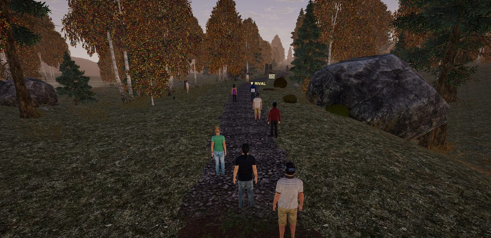
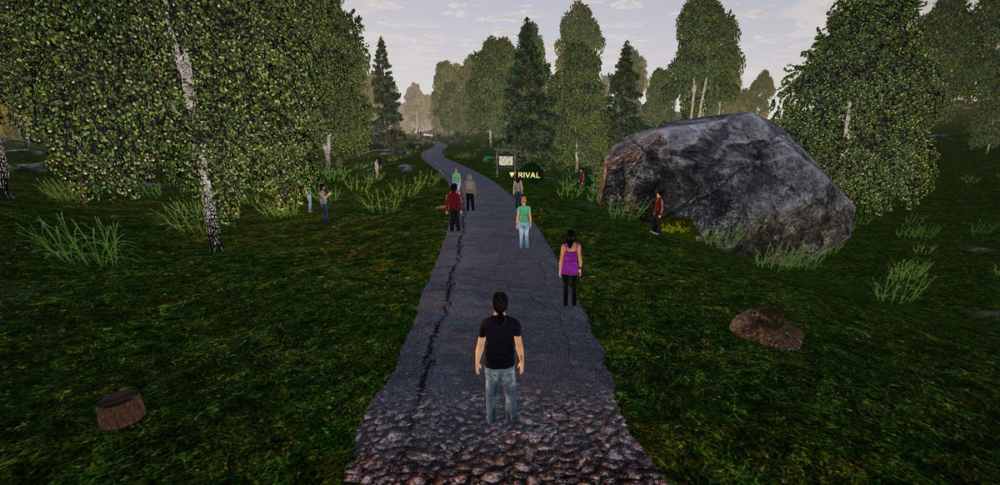
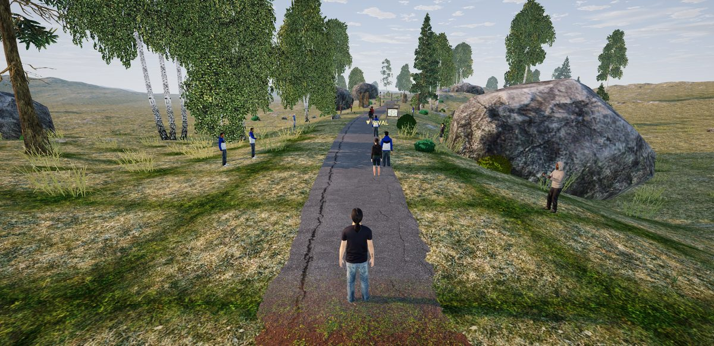
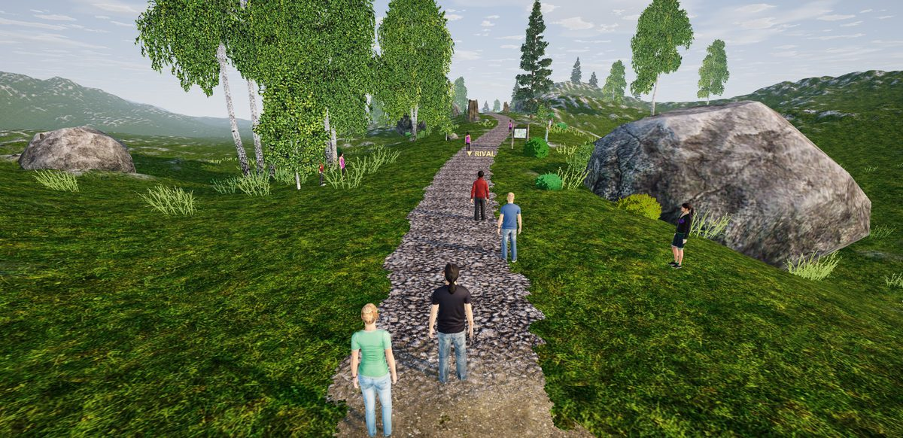
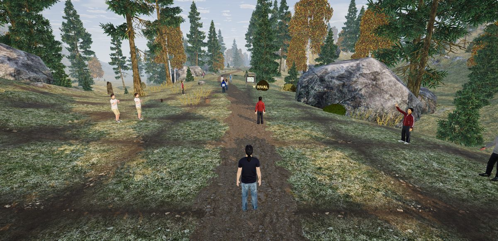
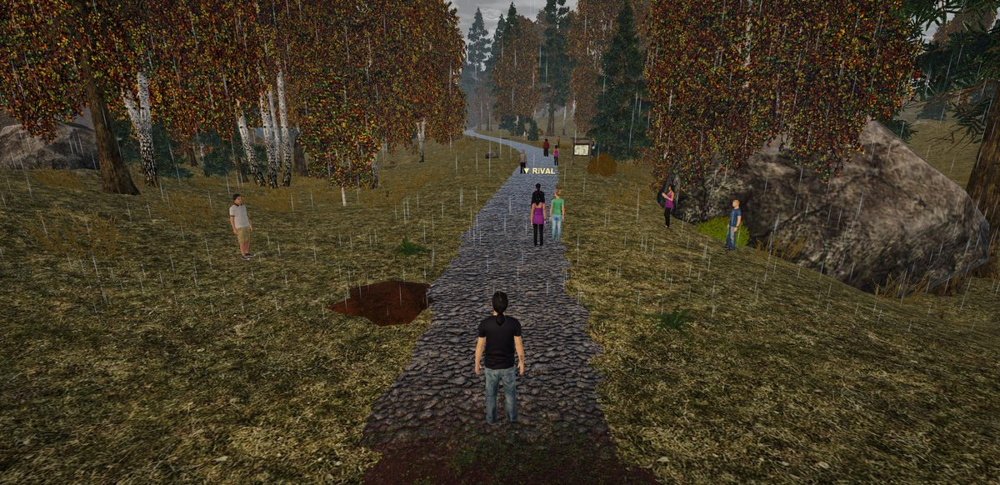
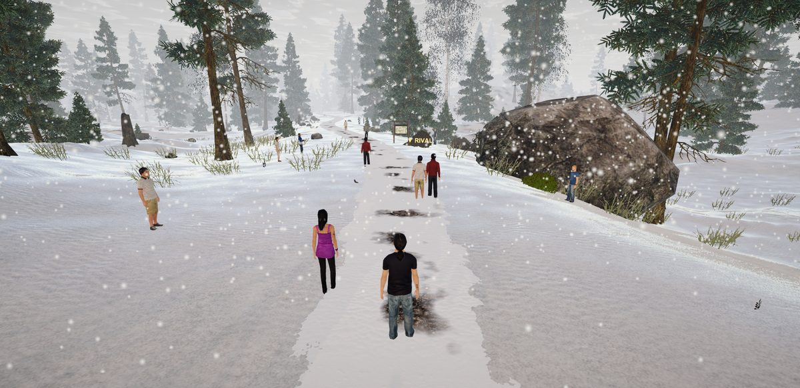
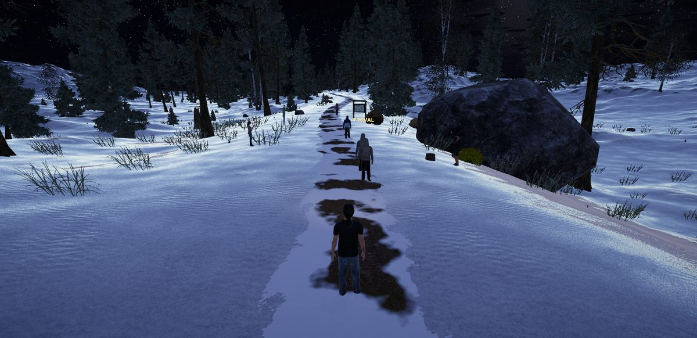

# Route collection

A few routes worth running – each one is a small recipe (parameters and a seed), so the app builds exactly
the same landscape, trail and wayside for everyone. Free to use (CC0).

| | Route | Course | Mood | Get it |
|---|---|---|---|---|
|  | **Morning mist at the mill brook** An autumn forest loop at 7:45 – ground fog in the hollows, a stream with a plank bridge, the sun just up. | 8 km loop · ↑72 m · max 9 % | autumn, 07:45 | [.jogroute](morning-mist-mill-brook.jogroute) · [QR](morning-mist-mill-brook-qr.png) |
|  | **Golden hour at the lake** A flat summer loop around a lake, low sun, long shadows – an easy evening run. | 7 km loop · ↑21 m · max 2 % | summer, 20:15 | [.jogroute](golden-hour-lake.jogroute) · [QR](golden-hour-lake-qr.png) |
|  | **Village-edge intervals** 5 km, starting on asphalt past the street lamps into the fields – made for interval workouts. | 5 km loop · ↑11 m · max 1 % | summer, 18:30 | [.jogroute](village-edge-intervals.jogroute) · [QR](village-edge-intervals-qr.png) |
|  | **Hunting-stand hills** Rolling meadows and forest edges in spring, two real climbs, hunting stands and hay fields. | 8 km loop · ↑107 m · max 10 % | spring, 10:00 | [.jogroute](hunting-stand-hills.jogroute) · [QR](hunting-stand-hills-qr.png) |
|  | **October pass** One long, steady climb to a mountain pass in autumn colours, and the way back down. | 8 km loop · ↑104 m · max 9 % | autumn, 11:30 | [.jogroute](october-pass.jogroute) · [QR](october-pass-qr.png) |
|  | **Rain run** Grey sky, steady rain, puddles and muddy forest paths – the run you'd skip outside. | 7 km loop · ↑65 m · max 8 % | autumn, 15:00, rain | [.jogroute](rain-run.jogroute) · [QR](rain-run-qr.png) |
|  | **Snowy winter forest** Falling snow in a conifer forest, the trail trodden into the snow. | 6 km loop · ↑53 m · max 10 % | winter, 13:00, snow | [.jogroute](snowy-winter-forest.jogroute) · [QR](snowy-winter-forest-qr.png) |
|  | **Starlit trail** A clear winter night at 22:00, new moon, far from any town – stars and the Milky Way, your head torch on the trail. | 6 km loop · ↑51 m · max 9 % | winter, 22:00 | [.jogroute](starlit-trail.jogroute) · [QR](starlit-trail-qr.png) |

## How to add a route

- **File:** download the `.jogroute` file into your *Downloads* folder (on a tablet: the app's exchange
  folder), then in the app: *My routes* → *Import* – the route is listed there.
- **QR code (Mac):** save the QR image into *Downloads* (or on the Desktop), then *My routes* → *Import* →
  *Read QR image*.
- **Code:** scan the QR code with a phone and paste the text under *My routes* → *Import*.

Made your own? Share it the same way – on a route's page, *Share* writes the file and the QR code.

Generated by `Editor/RouteCollection.cs`; preview pictures by `Tools/route-previews.sh`.
